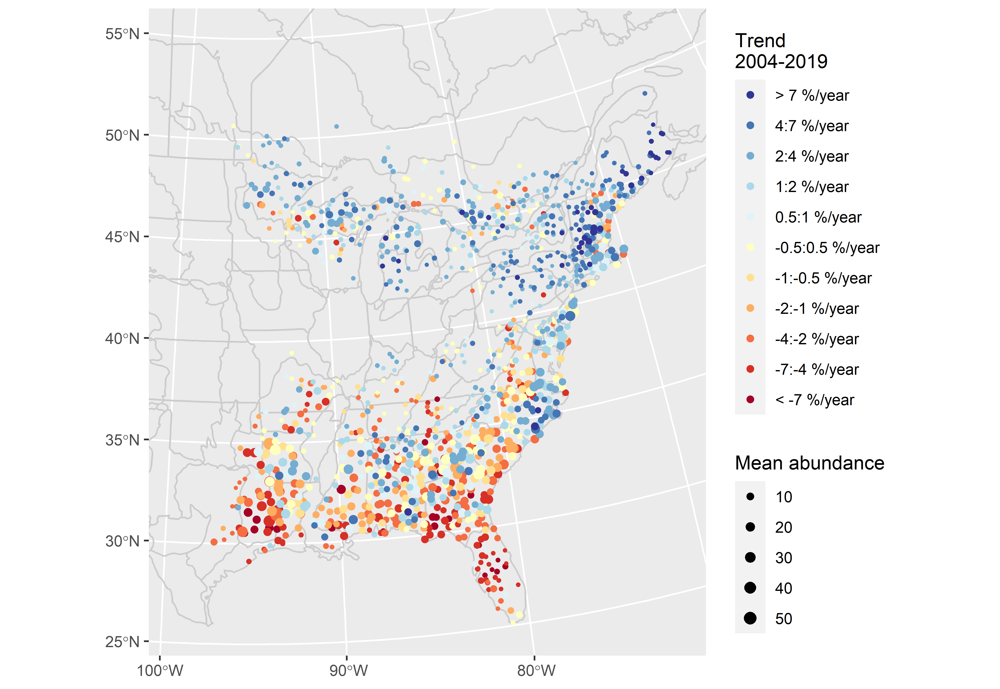

I am a quantitative ecologist with the Canadian Wildlife Service, a branch of Environment and Climate Change Canada. I am also an adjunct professor at Carleton University. 

My schooling is in biology. I have biology degrees from [Trent University](https://www.trentu.ca/biology/) and [Carleton University](https://carleton.ca/biology/). Over the course of my graduate studies, I morphed from a field biologist into a data-scientist/statistician. 
I specialize in using broad-scale bird monitoring data (North American Breeding Bird Survey, Christmas Bird Count, eBird, shorebird migration surveys, etc.) to [track changing bird populations](https://www.science.org/doi/10.1126/science.aaw1313) and to investigate the causes behind those changes.

## Bayesian Modelling
I use Bayesian statistical models in almost all of my projects. My recent work mostly relies on the probabilistic programming language [Stan](https://mc-stan.org/). It's powerful, flexible, supported by a brilliant community of constructive programmers and mathematicians, and it has excellent diagnostics. 

More philosophically, the Bayesian framework allows me to answer the questions of interest, without relying on a tortured triple-negative interpretation of alternate realities, and to incorporate prior ecological knowledge into analyses. If you want to hear some brilliant people talk about the benefits of Bayesian modeling, check out the podcast [Learning Bayesian Statistics](https://learnbayesstats.com/) and the book [Bernoulli's Fallacy](https://aubreyclayton.com/bernoulli)

## Open Science

My data-science work is all available on my [GitHub site](https://github.com/AdamCSmithCWS). I have immensely benefited from the open code and data of others. I have discovered that working openly and transparently improves my science (and makes life easier for me). I hope that making my work available and open will also be useful for others.  

