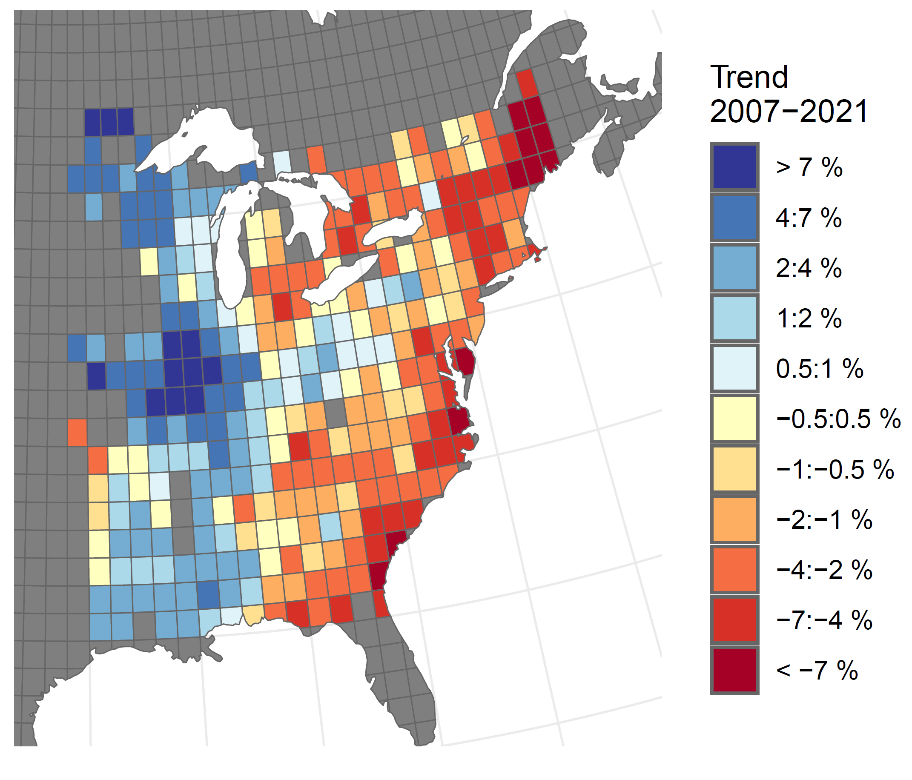

I am a quantitative ecologist with the Canadian Wildlife Service, a branch of Environment and Climate Change Canada. I am also an adjunct professor at Carleton University. 

### Heat map of Wood Thrush population trends 2007-2021, from the North American Breeding Bird Survey

